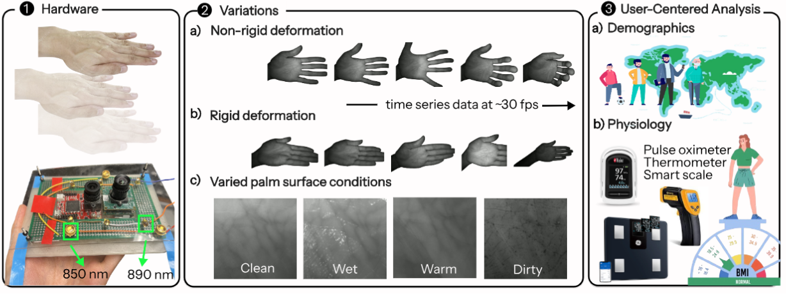

# Simulated In-the-Wild: A Labeled Dataset for Near-Infrared Palm Vein Recognition in Challenging Conditions

## Abstract
> Palm vein biometrics are increasingly popular for secure, non-contact user authentication, especially due to heightened awareness around hygiene after the pandemic. Vein biometrics offer an additional layer of security because the unique textures are protected beneath the skin and are visible only under near-infrared illumination. However, palm vein imaging is affected by various practical factors during the capture, including uneven lighting across captures, positional shifts relative to the camera, fluctuations in blood volume, surface noise from sweat or dirt, variations in near-infrared wavelengths, and non-rigid transformations of the palm. Addressing these complexities is essential to leveraging the global identity uniqueness of palm veins for reliable authentication in the wild. Prior studies of palm vein biometrics, however, commonly overlook these practical variations. Existing public datasets generally contain images captured under controlled conditions with limited variability;  industrial solutions are patented and closed. We propose a comprehensive dataset to capture the impact of these practical variations on palm vein imaging in real-world scenarios. It also includes physiological and demographic data to facilitate biometric fusion and provides time-series data for enhanced liveness detection.

<p align="center">	

</p>

## Dataset
The **CUP Dataset** will be available soon to researchers for non-commercial use. Due to the sensitive nature of the data, full access is restricted and requires formal approval. The link to download and release agreement form will be provided upon release. 

* Each user contributes 32 videos, combining:
    - Left and Right hands.
    - 4 palm surface conditions: Clean, Dirty, Wet, and Warm.
    - 2 illumination wavelengths (850 nm and 890 nm).
    - Captured by 2 cameras(See3 and OpenMV) with different resolution and sensitivity to near-infrared.
* During each video, the user varies palm poses, changes the distance to the camera, and rotates their palm to provide diverse perspectives.

## Usage
### ROI extraction from CUP raw videos
* Download raw videos from CUP dataset to `data/videos` (sample videos are provided).
* Run the following command
```bash
cd preprocessing
python prepare_data.py \
        --users "003" \
        --hands "L" \
        --cams "OpenMV" \
        --wavelengths "850" \
        --frames_per_minute 10 \
        --dump_landmarks \
        --save_failures \
        --fraction 10
```
* Frames with annotations and ROIs will be generated under `data/annotated_frames`

### Training and evaluation of models
* Use `prep_dataset` function in `train_eval/util.py` to prepare train, test, and validation directories from raw ROI directory(e.g. `data/annotated_frames/OpenMV_ROI`), surface/pose constraints can be specified (sample datasets are provided)
* After datasets are prepared in `train_eval/datasets`, follow the example in `train_eval/config.json` to specify training or evaluation details
* Run the following command to train or evaluate target models. 
```bash
cd train_eval
python main.py config.json
```

### Frictions and TRR analysis
* With the evaluation results of the models, frictions can be calculated as in `frictions.py`
* Use `trr/main.py` to conduct leave-one-out training for each subject, and then TRR can be calculated as in `trr.py`
